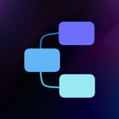

<p align="center"></p>

# Flowise [](https://stackblaze.com) [](https://github.com/stackblaze-templates/flowise/actions) [](LICENSE) [](https://stackblaze.com)

A low-code LLM app builder. Drag-and-drop UI to build customized LLM orchestration flows, chatbots, and AI agents.

> **Credits**: Built on [Flowise](https://flowiseai.com) by [FlowiseAI](https://github.com/FlowiseAI). All trademarks belong to their respective owners.

## Deploy on StackBlaze

This template includes a `stackblaze.yaml` for one-click deployment on [StackBlaze](https://stackblaze.com).

## Local Development

```bash
docker compose up
```

See the project files for configuration details.

---

### Maintained by [StackBlaze](https://stackblaze.com)

This template is actively maintained by StackBlaze. We perform **weekly automated checks** to ensure:

- **Up-to-date dependencies** — frameworks, libraries, and base images are kept current
- **Security scanning** — continuous monitoring for known vulnerabilities and CVEs
- **Best practices** — configurations follow current recommendations from upstream projects

Found an issue? [Open a ticket](https://github.com/stackblaze-templates/flowise/issues).
